# TRINETRA (त्रिनेत्र) 🛡️
### *Sensor-Agnostic AI Border Surveillance & Multi-Modal Threat Corroboration Platform*

[](https://fastapi.tiangolo.com)
[](https://react.dev)
[](https://vitejs.dev)
[](https://ultralytics.com)
[](https://opencv.org)
[](https://pytorch.org)
[](https://tailwindcss.com)
[](https://opensource.org/licenses/MIT)

---

## 📌 Executive Overview

**TRINETRA** (The Third Eye of Border Defense) is a sensor-agnostic, edge-accelerated border intelligence and situational awareness platform built for defense forces and border security agencies (e.g., BSF, Army, Paramilitary).

Modern border environments suffer from **sensor fragmentation**, **alert fatigue**, **weather-induced blind spots**, and **single-point sensor failures**. TRINETRA overcomes these challenges by unifying multi-modal telemetry—**Optical CCTV, Thermal FLIR, Doppler Ground Radar, Unattended Ground Seismic Sensors (UGS), Airborne UAVs, and ANPR Gates**—into a single spatio-temporally correlated, deduplicated Common Operational Picture (COP).

---

## ✨ Key System Capabilities

### 1. 🔍 Edge AI Object Detection & Vision Intelligence
- **Adaptive Contrast Enhancement (CLAHE)**: Automatically balances luminance across dark, shadowed, night-vision, and thermal surveillance frames to detect low-contrast targets.
- **Defense Taxonomy Mapping**: Dynamically classifies 18 standard COCO classes into domain categories: `person`, `vehicle`, `vessel`, `aircraft`, `baggage`, and `animal`.
- **Non-Maximum Suppression (NMS)** & **Boundary Validation**: Eliminates duplicate bounding boxes and filters invalid coordinates.
- **Resilient MOG2 Fallback**: Employs adaptive Gaussian Mixture background subtraction and morphological contour analysis when neural weights are unconstrained.

### 2. ⚡ Multi-Sensor Fusion & Alert Deduplication Engine
- **Spatio-Temporal Correlation**: Aggregates disparate observations within 60-120s time windows into a unified Incident rather than flooding operators with separate alerts.
- **Explainable Correlation Scoring**: Evaluates source diversity bonuses (CCTV, Thermal, Radar, UGS, UAV) and assigns confidence metrics ($0.0 - 1.0$).
- **Physical Contradiction Detection**: Flags anomalies (e.g., Radar detecting 60 km/h target with zero thermal/optical confirmation) as sensor inconsistencies rather than generating false panic.

### 3. 🎯 20-Node Surveillance Fleet Matrix & Digital Twin
- **Live 20-Camera Matrix**: Full interactive tactical grid covering 4 border sectors (Checkpoints, Zero-Line Wire, Patrol Corridor, Rear Logistics).
- **Target Tracking HUD**: Real-time velocity, range, azimuth, and trajectory vectors projected directly onto video streams.
- **Interactive Geospatial Map (Leaflet / 3D Twin)**: Live telemetry overlay with camera cones, sensor ranges, GPS breadcrumb trails, and exclusion zone geofences.

### 4. 🔒 Cryptographic Evidence Integrity (Chain of Custody)
- **SHA-256 Hashing**: Every observation, alert snapshot, and incident report is immutably hashed with timestamping for court-martial and legal admissibility.
- **Role-Based Access Control (RBAC)**: Enforces least-privilege security roles (`OPERATOR`, `INVESTIGATOR`, `SUPERVISOR`, `SYSTEM_ADMIN`) with immutable audit logs.

### 5. 🎬 4 Comprehensive Tactical Demo Scenarios
- **Scenario 1 (The Killer Demo)**: Multi-sensor night incursion (CCTV $\rightarrow$ Thermal IR $\rightarrow$ Doppler Radar $\rightarrow$ Seismic UGS $\rightarrow$ Deduplicated Incident INC-1042).
- **Scenario 2 (System Resilience)**: Camera tampering and fallback mesh handover.
- **Scenario 3 (Sensor Contradiction)**: Radar ghost target flagged as optical mismatch.
- **Scenario 4 (Continuous Cross-Camera Re-ID)**: Tactical vehicle route deviation tracking.

---

## 🏗️ System Architecture

```mermaid
graph TD
    subgraph SENSORS ["📡 Heterogeneous Sensor Layer"]
        CCTV["Optical CCTV (C-01 to C-20)"]
        TH["FLIR Thermal IR (T-01, T-02)"]
        RAD["Doppler Radar (R-01, R-02)"]
        UGS["Seismic Sensors (G-01 to G-04)"]
        UAV["Tethered UAV Feed (U-01)"]
        ANPR["Gate ANPR Scanner (A-01, A-02)"]
    end

    subgraph EDGE ["⚡ Edge AI Processing Engine"]
        CLAHE["Adaptive CLAHE Contrast Preprocessing"]
        YOLO["YOLOv8 INT8 Object Detection"]
        MOG2["Resilient MOG2 Vision Fallback"]
        TRACK["Centroid & IoU Target Tracker"]
    end

    subgraph CORE ["🧠 TriNetra Core Fusion & Intelligence"]
        FUSION["Multi-Sensor Fusion Engine"]
        CORR["Spatio-Temporal Deduplicator"]
        CONTRA["Sensor Contradiction Analyzer"]
        CONTEXT["Context & Threat Risk Engine"]
        XAI["Explainable AI (XAI) Generator"]
    end

    subgraph SECURITY ["🔐 Evidence & Security Layer"]
        SHA["SHA-256 Cryptographic Hasher"]
        RBAC["JWT Auth & Role Enforcer"]
        AUDIT["Immutable Audit Logger"]
    end

    subgraph UI ["🖥️ Command & Control Dashboard"]
        COP["Command Center (COP)"]
        MATRIX["20-Camera Fleet Grid"]
        MAP["Border Digital Twin (Leaflet / 3D)"]
        INC["Incident Resolution Desk"]
        DEMO["Interactive Demo Scenario Runner"]
    end

    SENSORS --> EDGE
    EDGE --> CORE
    CORE --> SECURITY
    SECURITY --> UI
```



---

## 📂 Repository Structure

```
TriNetra/
├── backend/                  # FastAPI Core Backend Service
│   ├── app/
│   │   ├── api/              # API Routers (cameras, incidents, sensors, auth, simulation)
│   │   ├── core/             # Configuration, Database Setup, Security & JWT
│   │   ├── db/               # Database Seeding & Schema Migrations
│   │   ├── models/           # SQLAlchemy ORM Data Models
│   │   ├── schemas/          # Pydantic Schemas & Validators
│   │   ├── services/         # AI Service, Fusion Engine, Tracker, Anomaly, ANPR
│   │   └── main.py           # FastAPI Application Entrypoint
│   └── requirements.txt      # Python Dependencies
├── frontend/                 # React 19 + Vite + TailwindCSS Frontend
│   ├── public/               # Public assets and video feeds
│   │   └── videos/           # 20 Border Surveillance Tactical Video Feeds
│   ├── src/
│   │   ├── components/       # Common UI, Navigation, Video HUD, Reticles
│   │   ├── context/          # Auth Context & Real-Time System State Provider
│   │   ├── pages/            # CommandCenter, Surveillance, BorderTwin, DemoScenarios, Incidents
│   │   └── services/         # API Service & Mock Intelligence Layer
│   ├── package.json          # Node Dependencies & Build Scripts
│   └── vite.config.js        # Vite Config
├── data/                     # Local Storage for Videos, Snapshots, and Evidence
├── docs/                     # Detailed Architectural & Protocol Documentation
├── scripts/                  # Video Generators & Synthetic Data Utilities
├── tests/                    # Automated Pytest Suite (AI detection, Fusion, RBAC, Hashes)
├── .gitignore                # Production Git Ignore Configuration
├── pytest.ini                # Pytest Configuration
└── README.md                 # Project Documentation
```

---

## 🚀 Quick Start Guide

### Prerequisites
- **Python 3.10+** (Tested on Python 3.12)
- **Node.js 18+ & npm**
- **Git**

---

### Step 1: Clone the Repository
```bash
git clone https://github.com/Preetjain0307/trinetra.git
cd trinetra
```

---

### Step 2: Backend Setup
```bash
# Create and activate Python virtual environment
python -m venv .venv

# On Windows:
.venv\Scripts\activate

# On Linux/macOS:
source .venv/bin/activate

# Install dependencies
pip install -r backend/requirements.txt

# Run automated tests to verify AI & Fusion engine
pytest -v
```

---

### Step 3: Frontend Setup
```bash
cd frontend
npm install
cd ..
```

---

### Step 4: Run the Full Platform

#### Start Backend Server:
```bash
# In root directory with virtual environment activated:
python -m uvicorn backend.app.main:app --host 127.0.0.1 --port 8000 --reload
```

#### Start Frontend Server:
```bash
# In frontend directory:
cd frontend
npm run dev
```

---

### Step 5: Access the Dashboard

- **Tactical Dashboard**: [http://localhost:5173/](http://localhost:5173/)
- **20-Camera Surveillance Grid**: [http://localhost:5173/surveillance](http://localhost:5173/surveillance)
- **Interactive Demo Scenarios**: [http://localhost:5173/demo-scenarios](http://localhost:5173/demo-scenarios)
- **FastAPI Interactive Docs (Swagger UI)**: [http://127.0.0.1:8000/docs](http://127.0.0.1:8000/docs)
- **System Health Status**: [http://127.0.0.1:8000/api/health](http://127.0.0.1:8000/api/health)

---

## 🧪 Testing & Validation

TRINETRA includes automated tests covering all critical components:

```bash
python -m pytest -v
```

### Test Coverage Highlights:
- `test_ai_detection.py`: Verifies CLAHE contrast enhancement, defense taxonomy normalization, NMS deduplication, and resilient fallback computer vision.
- `test_correlation_and_deduplication.py`: Confirms multi-sensor spatio-temporal deduplication.
- `test_contradiction.py`: Validates sensor inconsistency detection.
- `test_evidence_hashing.py`: Checks SHA-256 cryptographic proof generation.
- `test_rbac_and_auth.py`: Ensures secure JWT token generation and role verification.
- `test_simulation_scenarios.py`: Runs end-to-end execution of demonstration scenarios.

---

## 🔑 Default Credentials

For demonstration and evaluator testing:
| Role | Email | Password | Access Level |
| :--- | :--- | :--- | :--- |
| **System Admin** | `admin@trinetra.local` | `Trinetra@2026` | Full System Configuration & Audit Logs |
| **Tactical Supervisor** | `supervisor@trinetra.local` | `Trinetra@2026` | Incident Verification & Escalation |
| **Investigator** | `investigator@trinetra.local` | `Trinetra@2026` | Timeline Analysis & Evidence Export |
| **Border Operator** | `operator@trinetra.local` | `Trinetra@2026` | Live Camera Monitoring & Alert Review |

---

## 📜 License & Acknowledgments

This project is licensed under the **MIT License** - see the [LICENSE](LICENSE) file for details.

Developed for Smart India Hackathon (SIH) & Tactical Defense Border Security Innovations.
Developed with ❤️ by **Preet Jain** and Team.
